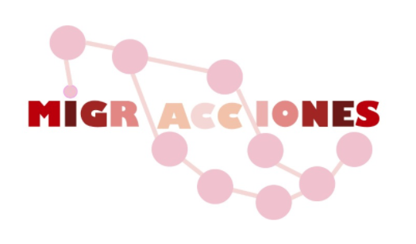

# Migracciones

<body>
<body style = "background-color:rgb(255,87,46);">
  

A serious game about the migration across Mexico. 
In resume, is a tabletop game in video, with a focus in the narrative part.

Articles about design process
- https://learto-ler.medium.com/designing-migracciones-first-part-the-concept-78bc0b1ff88c
- https://learto-ler.medium.com/designing-migracciones-second-part-the-characters-1476e386fa48
- https://learto-ler.medium.com/designing-migracciones-third-part-posmortem-58f5704ae83c

You can download version .8 in: https://leartoler.itch.io/migracciones 

Game Design Document: https://github.com/leartoler/migracciones/blob/main/Migracciones.pdf

</body>

